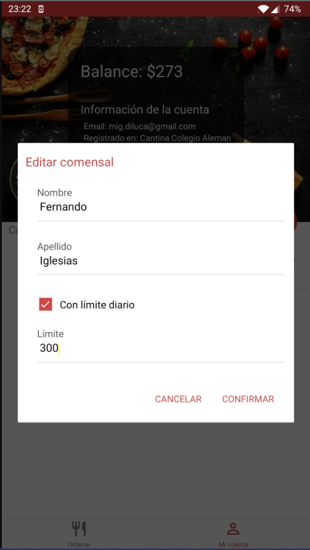

# Informe entrega 1

## Repositorio Git

#### Manejo de los repositorios locales y remotos

Nuestro equipo ha decidido utilizar múltiples ramas en el proyecto. La rama `main` será la rama estable en la cuál vamos a depositar todo el código y funcionalidades desarrolladas. En la rama `documentation` pondremos toda la documentación correspondiente y en la rama `develop` todo lo relacionado con el código de la implementación . Cada feature que vayamos a desarrollar tendrá su rama correspondiente para el orden y legibilidad del proyecto y llevará en su nombre una breve referencia para poder identificar a que parte del código hace referencia. Por ejemplo `feature/historial_pedidos` o `hotfix/listado_menu`.

#### Comandos git a utilizar:

-   `git init`
    -   Para inicializar el repositorio local
-   `git remote add origin https://github.com/OWNER/REPOSITORY.git`
    -   Para crear la conexión remota con el repositorio.
-   `git fetch`
    -   Para descargar commits, archivos y referencias del repositorio remoto al repositorio local.
-   `git pull`
    -   Para bajar los cambios del repositorio remoto al repositorio local.
-   `git add`
    -   Para contrastar los cambios hechos de forma local, contra el repositorio. Los cambios no son guardados con git add. Para eso debe luego utilizarse git commit.
-   `git commit`
    -   Para guardar todos los cambio realizados en el repositorio local al staging área.
-   `git push`
    -   Para subir los cambios realizados al repositorio.
-   `git branch`
    -   Para listar las ramas existentes. Crear y eliminar ramas.
-   `git merge`
    -   Para unir dos ramas.
-   `git checkout`
    -   Para salir de una rama y entrar a otra. Asumiendo estas ramas ya existen.
-   `git diff`
    -   Para identificar diferencias en el repositorio.
-   `git stash`
    -   Para almacenar temporalmente los cambios realizados en el código para que poder trabajar en otra cosa y, más tarde, regresar y volver a aplicar los cambios.

## Versionado

#### Mensajes de commits convencionales

Los commits van a seguir el siguiente formato:

<pre>
<b><a>&lt;tipo&gt;</a></b>(<b><a>&lt;alcance&gt;</a></b>): <b><a>&lt;asunto&gt;</a></b>
</pre>

**Tipos:**

-   Cambios relevantes:
    -   `feat` Commits que añaden nuevas características
    -   `fix` Commits que corrigen un error
-   Otros cambios:
    -   `refactor` Commits que reescriben o reestructuran el código por ejemplo para mejorar el rendimiento
    -   `docs` Commits que afectan solo a la documentación
    -   `build` Commits relacionados con el versionado y dependencias del proyecto
    -   `chore` Commits que impactan en cuestiones ajenas al código/documentación como por ejemplo el archivo `.gitignore`

**Alcance:**

-   El alcance proporciona información adicional sobre el contexto donde impacta el cambio

**Asunto:**

-   Contiene una breve descripción del cambio realizado.
-   Se utilizará el tiempo presente.
-   No vamos a escribir la primer letra en mayúscula.
-   No lleva punto final.

**Ejemplos:**

-   ```
    docs(informe1): transcripción de una entrevista
    ```
-   ```
    feat(login): add autentificación con cuenta de Google
    ```
-   ```
    build(package.json): actualización de dependencias
    ```

## Elicitación

#### Entrevistas

La primer técnica de elicitación que llevamos a cabo fue realizar tres diferentes entrevistas que traten de abarcar a los usuarios potenciales. Para esto se eligieron preguntas abiertas, diferentes para cada entrevistado, con la finalidad de conocer el contexto de cada uno. Posteriormente, se utilizaron preguntas mas específicas a cada situación y/o rubro.

Los entrevistados representaban diferentes grupos: Padres, Empleados del comedor escolar y Niños. De aquí se sacaron las siguientes conclusiones:

-   Lo primero que pudimos notar es que por lo general a los padres se les hace difícil hacer un seguimiento de lo que el niño consume en los comedores. Esto es debido a que le dan dinero para que compre lo que le apetezca durante la jornada.
-   Los niños muchas veces desconocen el menú semanal ya que no prestan atención a los medios tradicionales que utiliza el comedor para publicarlo. Esto deriva en que no compren el ticket diario para el almuerzo y compren golosinas o comida no adecuada para su correcta alimentación.
-   Por ciertas condiciones del trabajo de los padres, se les hace imposible prepararle comida para llevar y esto agudiza los puntos anteriores.

-   Los cocineros no saben exactamente cuanta comida realizar, produciendo desperdicio diario. Cabe enmarcar también que no están familiarizados con las diferentes situaciones de salud que pueden presentar los niños y podrían estar facilitando el acceso de ciertos alimentos a quienes presentan algún tipo de problema como por ejemplo intolerancia a las harinas o a la lactosa.

Creemos fuertemente que con el desarrollo de nuestra aplicación se podrían abordar todos estos problemas.

Las evidencias de las entrevistas pueden ser corroboradas aquí: [Entrevista 1](/docs/elicitacion/entrevistas/entrevista1.md), [Entrevista 2](/docs/elicitacion/entrevistas/entrevista2.md) y [Entrevista 3](/docs/elicitacion/entrevistas/entrevista3.md)

#### Análisis de Documentación

Buscando aplicaciones ya existentes encontramos OrderEAT. Un negocio planteado por tres estudiantes de un liceo que buscaban solucionar los problemas que afectan al servicio de su comedor. Los problemas eran : largas filas de treinta minutos para recibir el almuerzo, platos que llegaban fríos y muchas veces, se quedaban sin comer.
La plataforma tiene un doble objetivo. Por un lado, que los comedores y cafeterías escolares puedan digitalizar el servicio, cobrar a través de la plataforma, eliminar las filas de espera y disminuir la cantidad de comida desperdiciada. Por el otro, busca conectar a los padres con la alimentación de los hijos, ya que a través de la aplicación puedes hacer seguimiento sobre lo que consumen, los gastos que realiza cada chico y pueden configurar presupuestos o restricciones alimentarias.

###### De la documentación pudimos identificar los siguientes puntos:

| Solución para tutores y estudiantes:                | Solución para comedores/cafés:      |
| --------------------------------------------------- | ----------------------------------- |
| Pagos online desde la app                           | Mayor planificación                 |
| Evitar el manejo de efectivo                        | Disminución de carga horaria        |
| Familia involucrada en la alimentación              | Reducción de desperdicios           |
| Evitar problemas nutricionales y obesidad infantil  | Aumento de ventas                   |
| Reducir los tiempos de espera de entrega de pedidos | Registro total de las transacciones |

Además contamos con imágenes de la aplicación:




Las evidencias de la documentación puede ser corroborado aquí: [Nota ElPais](/docs/elicitacion/documentos/OrderEAT%20ElPais.pdf), [Nota ElObservador](/docs/elicitacion/documentos/OrderEAT%20ElObservador.pdf) y [Entrevista en TeleDoce](https://www.teledoce.com/?p=596829)

#### User Persona

Identificamos dos tipos de personas:

-   Madre de dos hijos casada y con un trabajo estable.
-   Padre soltero con un hijo y recursos ajustados.

A grandes rasgos, los usuarios ideales sobre los que nos vamos centrar para que hagan uso de nuestra aplicación están englobados por estos dos tipos.


#### Modelo conceptual del problema


## Especificación

### Requerimientos Funcionales

#### RF1 : Permitir compras a los comedores

-   **Autor:** Padre/Tutor
-   **Descripción:** El sistema debe permitir compras a los comedores de parte de los tutores para que los niños lo consuman en el comedor.
-   **Prioridad:** Alta.

#### RF2 : Se debe poder cargar dinero en una billetera virtual

-   **Autor:** Padre/Tutor
-   **Descripción:** El sistema debe permitir agregar dinero a una billetera virtual para poder comprar productos del comedor.
-   **Prioridad:** Alta.

#### RF3 : Se debe guardar un registro de todas las compras durante el mes

-   **Autor:** Padre/Tutor
-   **Descripción:** El sistema debe guardar un registro de las compras mensuales que los tutores pueden observar presionando un botón resumen.
-   **Prioridad:** Alta.

#### RF4 : Los comedores deben poder publicar y editar sus planificaciones de alimentos

-   **Autor:** Comedor
-   **Descripción:** Los comedores deben poder publicar y editar su planificación semanal, precios y ofertas del plato del dia en su perfil.
-   **Prioridad:** Media.

#### RF5 : Los comedores deben poder observar los platos reservados para el dia o semana

-   **Autor:** Comedor
-   **Descripción:** Los comedores deben poder observar cuantos platos reservados tienen para poder cocinar la cantidad correspondiente y no desperdiciar comida.
-   **Prioridad:** Baja.

#### RF6 : El sistema debe notificar a los tutores después de una compra

-   **Autor:** Padre/Tutor
-   **Descripción:** El sistema debe notificar a los tutores al momento de hacer una compra con la billetera virtual.
-   **Prioridad:** Baja.

#### RF7 : Debe restringirse el acceso de ciertos alientos a algunos niños

-   **Autor:** Padre/Tutor
-   **Descripción:** El sistema debe permitir a los padres restringir alimentos.
-   **Prioridad:** Media.

### Requerimientos no funcionales:

-   **RNF1:** El sistema debe estar integrado con la pasarela de pago MercadoPago
-   **RNF2:** El sistema utilizará protocolos https como método de seguridad.
-   **RNF3:** El sistema en la primera versión solo estará disponible en español.
-   **RNF4:** El sistema en su primera version deberá admitir 3 comedores con hasta 100 alumnos cada uno.
-   **RNF5:** El sistema debe ser compatible con Google Chrome.
-   **RNF6:** El sistema en su primera version debe ser compatible con dispositivos mobile, Android 10 e iOS 13 en adelante.
-   **RNF7:** El color primario debe ser Green 900 #1B5E20 y el secundario Light Blue 800 #0277BD
-   **RNF8:** La fuente a utilizar sera Roboto
-   **RNF9** El estilo de los iconos sera filled
-   **RNF10** Los estilos de los componentes serán bajo las especificaciones de [Material Design](https://m3.material.io/)

### Historias de Usuario

-   **ID:** 1
-   **Título:** Seguimiento del consumo del niño
    -   **Como** padre de un niño que consume en el comedor
    -   **Quiero** ver que en que alimentos utiliza el dinero
    -   **Para** asegurarme que coma lo correcto y se mantenga saludable
-   **Criterios de aceptación:**

    -   **Dado** el padre registrado
    -   **Cuando** quiera ver el historial en el comedor
    -   **Entonces** se le mostrara en pantalla el dinero total gastado y un listado con todos los productos con su fecha correspondiente.
    <hr>

-   **ID:** 2
-   **Título:** Agregar nuevo producto al comedor
    -   **Como** empleado de un comedor escolar
    -   **Quiero** agregar un nuevo producto
    -   **Para** que los niños puedan consumirlo
-   **Criterios de aceptación:**

    -   **Dado** el empleado registrado
    -   **Cuando** quiera registrar un nuevo producto
    -   **Entonces** podrá agregar una foto, precio y descripción.
    <hr>

    -   **ID:** 3

-   **Título:** Compra de merienda
    -   **Como** padre de un niño que regularmente consume en el comedor escolar
    -   **Quiero** comprar una merienda saludable
    -   **Para** que mi hijo tenga su merienda y así estar involucrado en la alimentación
-   **Criterios de aceptación:**

    -   **Dado** el padre registrado en el sistema
    -   **Cuando** quiera comprar la merienda
    -   **Entonces** se le mostrara en pantalla todas las opciones que la cantina ofrece.

### Casos de Uso

-   **Título:** Consultar resumen mensual
-   **Actor:** Padre/Tutor
-   **Precondición:** El tutor ya esta registrado y tiene a su hijo asignado
-   **Curso normal:**
    -   1 (Actor): Ingresa a la aplicación
    -   2 (Sistema): Muestra la ventana principal
    -   3 (Actor): Selecciona menú desplegable
    -   4 (Sistema): Muestra todas las opciones
    -   5 (Actor): Selecciona opción de ver resumen
    -   6 (Sistema): Muestra total de dinero gastado y una lista con los productos y su fecha
-   **Curso alternativo:**

    -   5.1 (Actor) Si selecciona resumen de un mes pasado
    -   5.2 (Sistema) Descarga en formato PDF el resumen.
    -   6.1 (Sistema) Si no tiene ningún gasto muestra un mensaje en pantalla.
    <hr>

-   **Título:** Cargar billetera virtual
-   **Actor:** Padre/Tutor
-   **Precondición:** El tutor ya esta registrado y tiene a su hijo asignado
-   **Curso normal:**
    -   1 (Actor): Ingresa a la aplicación
    -   2 (Sistema): Muestra la ventana principal
    -   3 (Actor): Selecciona opción dinero en barra de navegación
    -   4 (Sistema): Muestra sección dinero
    -   5 (Actor): Presiona botón cargar dinero
    -   6 (Sistema): Muestra opciones como tarjeta de crédito, débito o MercadoPago
-   **Curso alternativo:**
    -   6.1 (Sistema) Si ya tiene tarjeta precargada muestra opción de esa tarjeta.
-   **Postcondición:** Se debe visualizar el monto cargado en el saldo de la billetera virtual.

<hr>

-   **Título:** Agregar un producto al carrito
-   **Actor:** Padre/Tutor
-   **Precondición:** El tutor ya esta registrado y tiene a su hijo asignado
-   **Curso normal:**
    -   1 (Actor): Ingresa a la aplicación
    -   2 (Sistema): Muestra la ventana principal
    -   3 (Actor): Selecciona opción de menú de la sección principal
    -   4 (Sistema): Muestra la lista de platos para ese día y los siguientes.
    -   5 (Actor): Presiona en agregar al carrito en una de las opciones de platos
    -   6 (Sistema): Agrega al carrito y notifica.
-   **Curso alternativo:**
    -   6.1 (Sistema) Si ha ocurrido una falla durante el proceso lo notifica y no agrega al carrito.
-   **Postcondición:** El menú seleccionado se mostrará en carrito.

### Bocetos de IU


## Validación y verificación

Con respecto a la validación del prototipo, la demo de los prototipos se mostraron a los entrevistados. En general tuvo buena aceptación, la interfaz resultó amigable y entendible para ellos.
Además surgieron algunas sugerencias, como por ejemplo: mostrar mensajes de errores si llega a fallar alguno de los procesos, que al cargar plata se muestren diferentes montos como opciones a elegir para así facilitar la decision de carga del padre, y que se pueda ver el saldo disponible en todo momento.

| Nro. Req.                                                                           | R1  | R2  | R3  | R4  | R5  | R6  | R7  |
| ----------------------------------------------------------------------------------- | --- | --- | --- | --- | --- | --- | --- |
| ¿Está correctamente priorizado?                                                     | Si  | Si  | Si  | Si  | Si  | Si  | Si  |
| ¿Las tipos de usuario están identificados?                                          | Si  | Si  | Si  | Si  | Si  | Si  | Si  |
| ¿Respeta la estructura y apartados de estándar ?                                    | Si  | Si  | Si  | Si  | Si  | Si  | Si  |
| ¿Se identifica y describen las dependencias con otros sistemas?                     | No  | Si  | No  | No  | No  | Si  | No  |
| ¿Están todas las características de calidad tenidas en cuenta en la especificación? | Si  | Si  | Si  | Si  | Si  | Si  | Si  |
| ¿Tiene una única interpretación?                                                    | Si  | Si  | Si  | Si  | Si  | Si  | Si  |
| ¿Es verificable de alguna manera?                                                   | Si  | Si  | Si  | Si  | Si  | Si  | Si  |
| ¿Es consistente y con un nivel de detalle adecuado?                                 | Si  | Si  | Si  | Si  | Si  | Si  | Si  |
| ¿Está duplicado o tiene conflicto con otro requerimiento?                           | No  | No  | No  | No  | No  | No  | No  |
| ¿Está dentro del alcance a resolver?                                                | Si  | Si  | Si  | Si  | Si  | Si  | Si  |
| ¿Evita incluir aspectos de diseño o implementación?                                 | Si  | Si  | Si  | Si  | Si  | Si  | Si  |
| ¿Se identifica correctamente y de forma única?                                      | Si  | Si  | Si  | Si  | Si  | Si  | Si  |
| ¿Se identifica claramente el origen?                                                | Si  | Si  | Si  | Si  | Si  | Si  | Si  |

## Reflexión

#### Reflexión Sebastian Borjas.

Mi aporte en durante el proceso fue:

-   Aportar ideas para los mensajes convencionales de git y nombre de las ramas.
-   Diseñar preguntas y conseguir candidatos para las entrevistas.
-   Transcribir las entrevistas y aportar para conclusión.
-   Realización de User personas.
-   Aporte en los casos de usos.
-   Desarrollo de los requerimientos funcionales y no funcionales.
-   Ideas en el desarrollo de los prototipos.
-   Priorización de los requerimientos.
-   Validación de lo realizado con las personas entrevistadas.

Desde mi punto de vista fue interesante aprender todos los pasos previos al desarrollo del código. Es muy bueno ir obteniendo experiencia en la comunicación con quienes van a ser usuarios de mi sistema porque esto ayuda a que la solución sea amigable para ellos.

Aprendí que el software de calidad no se obtiene de un día para el otro, es decir, hay que invertir mucho tiempo investigando no solo el problema sino también el entorno y todas las posibles soluciones.

Aplicamos las técnicas que creímos relevantes para toda la elicitación.

También aprendí mucho con Git, si bien tenía un poco de experiencia, fue la primera vez trabajando con alguien en simultaneo y esto ayuda a darse cuenta de la importancia de la comunicación entre desarrolladores, ya desde los mensajes de los commits.
