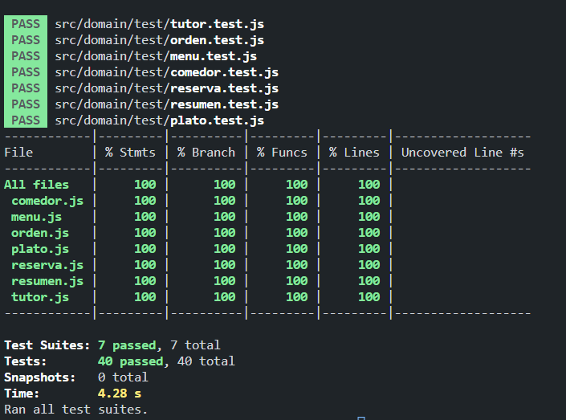

# Informe entrega 2

## Construcción

### Dependencias:
- #### ESLint `8.41.0`
  ESLint es un analizador estático de JavaScript configurable que nos ayuda a encontrar problemas en nuestro código. Estos problemas pueden ir desde potenciales bugs en tiempo de ejecución, no seguir buenas prácticas de codificación, hasta problemas de estilos. Su objetivo principal es mejorar la calidad y legibilidad del código, así como mantener una consistencia en el estilo de programación. Su funcionamiento se basa en analizar el código fuente sin ejecutarlo y aplicar una serie de reglas predefinidas o personalizadas para identificar los posibles problemas ya mencionados. En nuestro caso utilizamos las reglas predefinidas por Google que están presentes en la siguiente dependencia `"eslint-config-google": "^0.14.0"`.
- #### Webpack `5.87.0`
  Webpack es una herramienta usada en el desarrollo web para gestionar y optimizar los archivos estáticos de una aplicación. Básicamente, toma varios archivos de entrada, como archivos JavaScript, CSS, imágenes, fuentes, entre otros, y los combina en un número reducido de archivos de salida optimizados. Esto tiene un gran beneficio y es que permite reducir el número de solicitudes al servidor y mejora el rendimiento de la aplicación. 
  También se pueden configurar plugins como es el caso de `"html-webpack-plugin": "^5.5.3"` que se encuentra presente en nuestras dependencias. Este, simplifica la generación y la gestión de archivos HTML en el proceso de construcción de una aplicación web, es decir, inserta de forma automática las etiquetas `<script>` y `<link>` necesarias en el archivo HTML para cargar los archivos JavaScript y CSS generados por Webpack.
  Para el manejo de webpack utilizamos la dependencia `"webpack-cli": "^5.1.4"` (interfaz de línea de comandos o CLI en inglés) que es una herramienta complementaria que facilita la ejecución de comandos relacionados con la construcción y el empaquetado de proyectos. En nuestro caso `npm run start` corre el comando `webpack-cli serve` que inicia un servidor de desarrollo para servir la aplicación y recargar automáticamente los cambios en tiempo real durante el desarrollo, esto lo hace en conjunto con `"webpack-dev-server": "^4.15.1"` que permite ejecutar una instancia del servidor web. Cuando se ejecuta, el servidor sirve los archivos estáticos generados por Webpack en la memoria, lo que resulta en tiempos de carga más rápidos y facilita el desarrollo iterativo. Y por último `npm run build` ejecuta `webpack build --mode=production` que se utiliza para ejecutar el proceso de construcción de Webpack en modo de producción.
  Ademas, para integrar toda la aplicación con webpack usamos módulos como `"sass-loader": "^13.3.2"` que nos permite cargar y compilar archivos Sass o SCSS, `"style-loader": "^3.3.3"` que permite que los estilos CSS o SCSS definidos en archivos separados se cargan dinámicamente en el navegador mediante la inyección de etiquetas `<style>` en el DOM, `"postcss-loader": "^7.3.3"` para que estos archivos de estilos mencionados anteriormente sean procesados por PostCSS primero y `"css-loader": "^6.8.1"` que hace que los archivos CSS se procesen y se conviertan en un módulo JavaScript que contiene el código CSS correspondiente para facilitar la integración.
  <link href="bootstrap"></link>
- #### Bootstrap `5.3.0`
  Para darle estilos a nuestro HTML usamos Bootstrap, que además de ser un gran framework de css, era un requerimiento de la letra de este proyecto. Este framework, es de código abierto y es ampliamente empleado para el desarrollo de sitios web y aplicaciones web responsivas. Fue creado por Twitter y ahora es mantenido por la comunidad. Proporciona una colección de herramientas, estilos predefinidos y componentes de interfaz de usuario que facilitan la creación de interfaces web modernas y atractivas. El objetivo principal de Bootstrap es agilizar el proceso de diseño y desarrollo. Además, para tener un mejor manejo de nuestros propios estilos usamos `"sass": "^1.63.4"`, una extensión de CSS que agrega características y funcionalidades adicionales como Variables y Anidamiento de reglas. Su finalidad es extender las capacidades de CSS con estas características y otras más, y `"autoprefixer": "^10.4.14"` que es una herramienta para que CSS funciones en versiones antiguas de navegadores.
  En conjunto con bootstrap también utilizamos la dependencia `"@popperjs/core": "^2.11.8"` para controlar la posición de elementos emergentes, como menús desplegables, tooltips (información sobre herramientas) y popovers.
- #### Jest `29.5.0`
  Esta dependencia es un framework de JavaScript desarrollado por Facebook que se utiliza pare realizar pruebas unitarias. Su finalidad es simplificar el proceso de escribir y ejecutar pruebas unitarias con una sintaxis clara, configuración automática, ejecución rápida y características avanzadas.
  Para la correcta ejecución de estas pruebas unitarias con Jest usamos `"@babel/core": "^7.22.5"`.Babel es utilizado para transformar y compilar código JavaScript moderno (como ES6/ES2015+) en una forma compatible con versiones anteriores de JavaScript que pueden ser ejecutadas en navegadores y entornos que no admiten características más recientes del lenguaje. Es una herramienta muy popular en el ecosistema de JavaScript.
  Para su configuración empleamos las dependencias `"@babel/preset-env": "^7.22.5"`, configuraciones preestablecidas (preset) en Babel que nos permite utilizar las características más recientes de JavaScript, y `"babel-jest": "^29.5.0"`, paquete que proporciona integración entre Babel y Jest, permitiendo utilizar Babel como transcompilador (convierte lenguaje de programación el otro similar) de JavaScript durante la ejecución de pruebas con Jest.

## Interfaz de usuario
 Para desarrollar la interfaz de usuario nos fue de gran ayuda el framework bootstrap ([ver documentación](#bootstrap-530)) para que sea responsiva. Se adapta a pantallas de dispositivos mobile como de escritorio.
  La interfaz cumple con los principios de accesibilidad WCAG. En la siguiente imagen se puede apreciar una evaluación hecha por la extensión WAVE.

## Codificación

Para la codificación se usó Visual Studio Code (IDE) y se siguieron los estándares de codificación establecidos por Google para HTML, CSS y JavaScript que fueron validados por ESLint ([ver documentación](#eslint-8410)).
Se priorizó el uso de buenas prácticas de programación separando el Dominio de la Interfaz. Para la parte de Dominio se utilizó OOP y las clases desarrolladas fueron:
- comedor.js
- menu.js
- orden.js
- plato.js
- reserva.js
- resumen.js
- tutor.js
## Test unitario
  Los test unitarios fueron realizados con Jest ([ver documentación](#jest-2950)). Ejecutamos un test por clase y se logró un 100% de cobertura que se puede observar en la siguiente imagen.
  

## Reporte de Issues
Serán reportados en la sección Issues de Github.
## Reflexión
- #### Sebastian Borjas
  Me pareció muy interesante haber llevado a cabo este proyecto. Es la primera vez que hago uno aplicando los fundamentos de ingeniería de software y esto me hizo descubrir la importancia de aplicar de forma correcta todos los principios. Es interesante ver como al pasar por todas las etapas el proyecto va tomando forma. Algunas tecnologías ya las conocía, pero para documentarlas tuve que profundizar mi conocimiento y las otras que no tuve que aprenderlas, lo cual resultó desde mi punto de vista una actividad muy enriquecedora.
  Mi aporte en esta parte del proyecto fue en la instalación de dependencias y configuración, en el desarrollo de las clases del dominio, en el desarrollo de la interfaz y en los test unitarios. En conclusión, creo que fue de gran ayuda este proyecto para entender los fundamentos y su importancia, y espero que el conocimiento obtenido me ayude en el futuro.
- #### Agustina Martínez
  Llevar a cabo este proyecto me permitió comprender la importancia de seguir los fundamentos de ingeniería de software de manera adecuada. A medida que avanzaba por cada etapa del proyecto, pude ver cómo iba tomando forma y cómo cada decisión y acción que tomábamos tenía un impacto en el resultado final. Aunque ya tenía cierto conocimiento sobre algunas tecnologías utilizadas en el proyecto, tuve la oportunidad de profundizar aún más en ellas. Además, me enfrenté a nuevas tecnologías que tuve que aprender, lo cual resultó en una experiencia sumamente enriquecedora, como lo fueron las pruebas unitarias con Jest.
  Mi aporte en esta parte del proyecto fue en el desarrollo de las interfaces, en la lógica para la funcionalidad de las interfaces y en la instalación y comienzo de los test unitarios. En conclusión estuve involucrada en gran parte del desarrollo de toda la aplicación.
